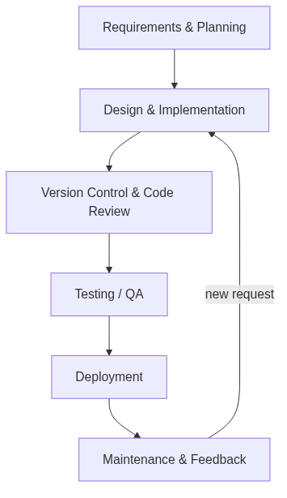
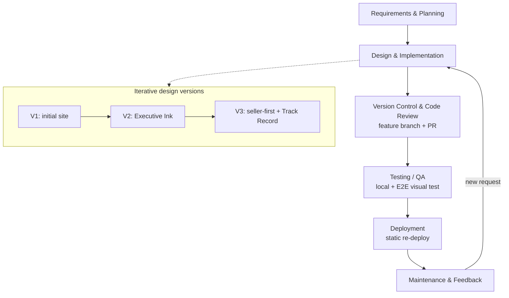
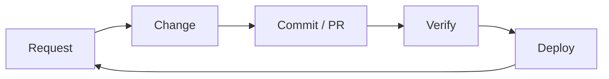

# Website Build — SDLC Summary

A brief account of how the **Jon Grorud** personal website was built, framed
around the Software Development Life Cycle (SDLC).

## Timeline at a glance

| Date | Phase | What happened |
| --- | --- | --- |
| Jun 6 | Requirements & planning | Defined goals, audience, and a no-build tech stack (HTML/CSS/vanilla JS) |
| Jun 6 | Implementation (V1) | Initial site scaffold; Home/About/Contact; rebranded to Jon Grorud |
| Jun 8 | Design iteration (V2) | "Executive Ink" redesign sourced from the CV |
| Jun 8–9 | Design iteration (V3) | Seller-first positioning, refined hero/typography, added Track Record page, copy refinements |
| Jul 5 | Change management | Renamed customer boxes; made dark mode the default |
| Jul 5 | Testing / QA | Local + end-to-end visual test, recording and report on the PR |
| Jul 5 | Deployment | Published static site; re-deployed for each change |

## Phases

### 1. Requirements & planning
- Goal: a fast, dependency-free personal site for *Jon Grorud, Strategic
  Enterprise Software Executive*, with **Home**, **About**, and **Contact**.
- Tech decision: plain HTML, CSS, and vanilla JavaScript — **no build step, no
  framework, zero runtime dependencies** — for simplicity and easy hosting.

### 2. Design & implementation (iterative versioning)
Each design direction lived on its own branch so it could be reviewed
independently instead of overwriting the previous one:
- **V1** (`devin/1780776875-personal-website`) — first working site, then
  rebranded to Jon Grorud.
- **V2** (`jon-profile-v2`) — "Executive Ink" redesign sourced from the CV.
- **V3** (`jon-profile-v3`) — final direction: seller-first positioning,
  refined hero and typography, added a **Track Record** page, plus several
  copy-refinement commits.

### 3. Version control & code review
- Every version was a **feature branch** with its own **Pull Request**
  (PR #1, #2, #3), producing a reviewable diff and full history.
- The latest work is **PR #4**, branched off V3 to keep new changes isolated
  from the reviewed baseline.

### 4. Change management (recent enhancements)
Two scoped changes, each an atomic commit on PR #4:
- Renamed 5 customer boxes → Mercedes, Deutsche Bank, AstraZeneca, Nokia,
  Ericsson.
- Made **dark mode the default** for first-time visitors, while still
  respecting a returning visitor's saved preference.

### 5. Testing / QA
- Verified locally (served the site, inspected the rendered DOM).
- Ran an **end-to-end visual test** with a screen recording and a test report
  attached to the PR.

### 6. Deployment & release
- Published as a **static deployment** at
  <https://devin-demo-fgwlpfki.devinapps.com>.
- The deploy is a static snapshot, so each release is an explicit re-deploy.

### 7. Maintenance & feedback loop
- Iterating on feedback (label corrections, dark-mode default, URL handling).
- Each round follows the same loop: **change → commit → verify → redeploy**.

## Process diagram

### Feedback loop (simplified)

